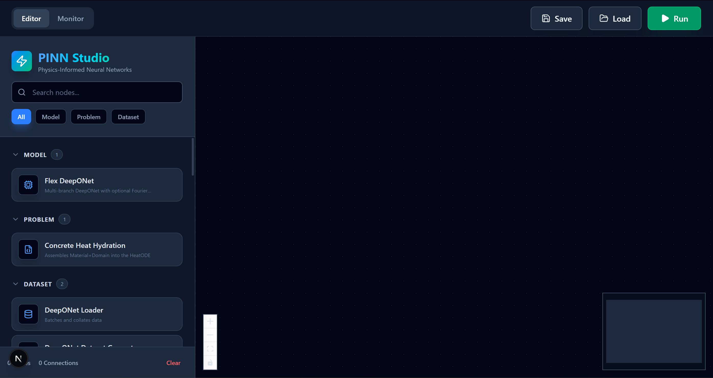
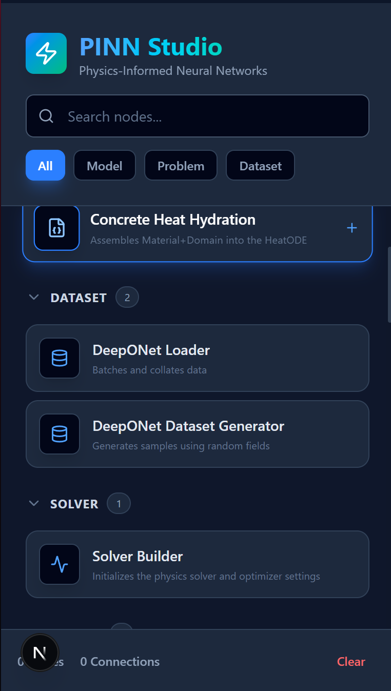
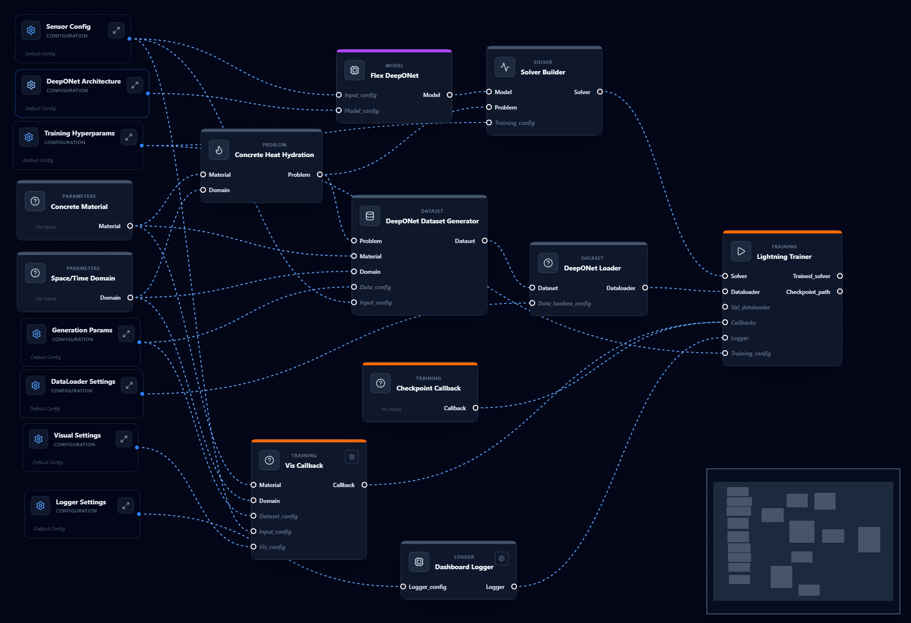
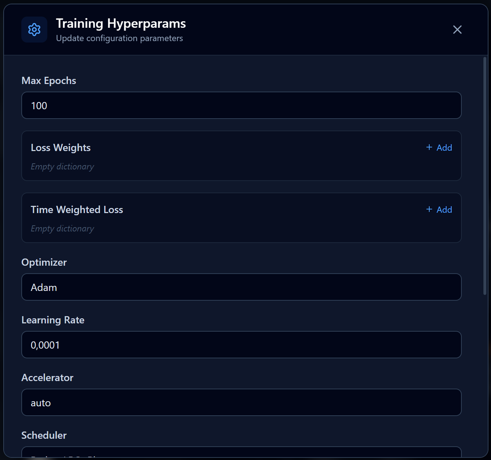
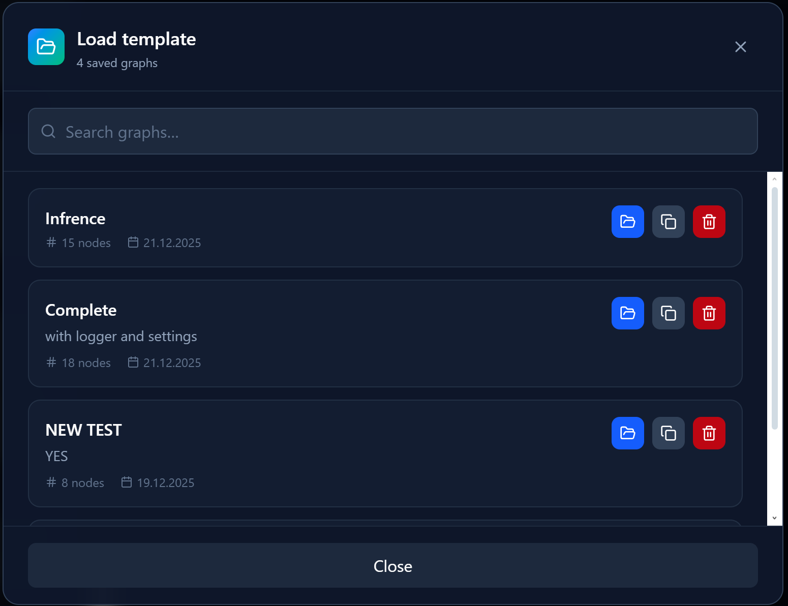
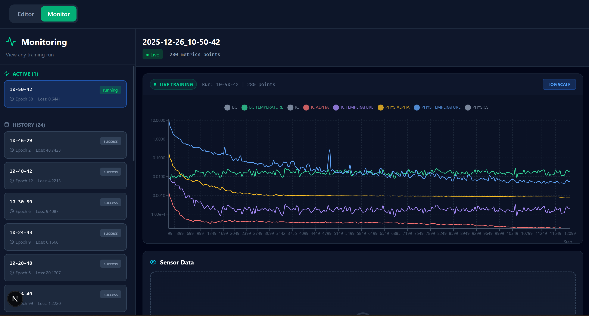

# PINNs Node Editor & Monitor

**A comprehensive visual interface for designing, executing, and monitoring Physics-Informed Neural Network (PINN) workflows.**

---

## Key Features

*   **Visual Graph Editor:** Design complex PINN architectures and training pipelines using a node-based interface.
*   **Dynamic Configuration:** Edit node properties (hyperparameters, paths, model settings) directly within the UI via dynamic forms.
*   **Project Management:** Save your experimental setups as graphs and reload them anytime.
*   **Real-Time Monitoring:** Live tracking of loss curves, sensor data, and training metrics via WebSocket integration.
*   **Session Persistence:** The system maintains execution state on the backend, allowing you to refresh the browser without interrupting an active training run.

---

## Application Tour

### 1. The Workspace
The editor starts as a clean slate where you can begin composing your experiment.




### 2. Node Selection & Graph Design
Construct your pipeline by clicking on nodes in the sidebar registry. Nodes are categorized by function (Data Loading, Model Architecture, Training Config, etc.).



### 3. Constructing a Training Tree
Connect nodes to define the flow of data and configuration. This example shows a complete training tree setup for a simulation, linking inputs to models and loggers.



### 4. Configuration Management
Click on any **Config Node** to open the inspector form. Here you can fine-tune hyperparameters, file paths, and physical constants without touching the code.




### 5. Project Controls
Use the control panel to **Run** simulations, **Save** your current graph to the database, or **Load** previous experiments. The system handles background execution locks to prevent conflicts.


### 6. Loading Experiments
The Load dialog allows you to browse saved graphs, viewing metadata like tags and descriptions before importing them into the canvas.




### 7. Real-Time Monitoring
Switch to the **Monitor Tab** to watch your training in action.
*   **Active Runs:** See currently executing jobs with live status indicators.
*   **History:** Browse metrics from past completed runs.
*   **Visualizations:** View live Loss Curves and Sensor Data (updated via WebSockets).




---

## Technology Stack

*   **Frontend:** React, TypeScript, React Flow (graph engine), Recharts (visualization), TailwindCSS.
*   **Backend:** Python, FastAPI, NumPy/Pandas.
*   **State Management:** Custom WebSocket event bus for real-time synchronization between the Python trainer and React dashboard.
*   **ML Framework:** PyTorch / Lightning (integrated into the compute nodes).

---
## Getting Started

### Prerequisites
*   **Node.js** (v18+) & npm
*   **Python** (v3.9+) & Conda
*   **Git**

### Installation

1.  **Clone the repository**
    ```
    https://github.com/7Solomon/Pinns4PreCast.git
    cd Pinns4PreCast
    git checkout node_based
    ```

2.  **Environment Setup**
    Create the Conda environment using the provided YAML file. This installs Python and all necessary dependencies.
    ```
    conda env create -f environment.yaml
    conda activate pinns4preCastNodes
    ```
    *(If you update dependencies later, run `conda env update -f environment.yaml --prune`)*

### Quick Start

This project provides automation scripts to launch both the Backend (FastAPI) and Frontend (Next.js) simultaneously.

#### Linux / macOS
Make the script executable and run it:
```
chmod +x start.sh
./start.sh
```


#### Windows (PowerShell)
Right-click `start.ps1` and select "Run with PowerShell", or run via terminal:
```
.\start.ps1
```


*The application will launch at:*
*   **Frontend:** `http://localhost:3000`
*   **Backend API:** `http://localhost:8000`

---

### Manual Start (Alternative)
If you prefer running services separately for debugging:

**Backend:**
```
conda activate pinns4preCastNodes
python -m uvicorn src.api.main:app --host 0.0.0.0 --port 8000 --reload
```

**Frontend:**
```
cd frontend
npm install # Only needed the first time
npm run dev
```